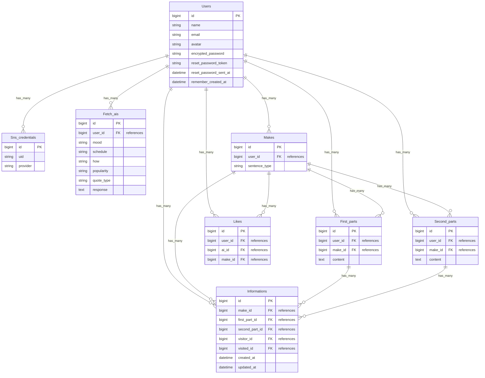

## ■サービス名
### [MeigenOtter](https://meigenotter.com/)

## ■サービス概要
AIを使った名言提供サービスです。
その日の気分や予定に基づいて、偉人、有名人、書籍、映画、漫画、アニメの中から、名言を提供します。
言葉を通じて、心のエネルギーをサポートします。

## ■想定されるユーザー層
- リモートワークの多いビジネスパーソン
- 受験生や学生
- セルフケアに取り組んでいる方

## ■サービスコンセプト
日々の生活の中で、「やる気が出ない」「パフォーマンスが上がらない」「人とあまり関わりたくない」など、誰もが時々ネガティブな気持ちに襲われることがあると思います。私自身もそのように感じることがしばしばあります。以前、スポーツ選手として活動していた時には、名言を読むことでモチベーションを上げ、トレーニングにも熱が入り、より良い結果を出すことができました。その経験をもとに、簡単な質問に答えるだけで、ユーザーにぴったりの名言や格言を提供し、心のエネルギーを少しでもサポートできたらと思い、当アプリを開発しました。

## ■ユーザー体験
ユーザーは、トップページからボタンひとつで名言を取得できます。体験終了後、ユーザー登録をすることで、選択肢を選んでユーザーにぴったりの名言を取得することが可能です。今の気分、今日の予定、どのような名言か、作品の有名度、名言の種類という5つの項目をプルダウンメニューから簡単に選択し、個人に合った名言や格言を受け取ることができます。未ログインのユーザーも体験することで、スムーズにユーザー登録を促すことができます。

## ■差別化、売りのポイント
- 気分、予定、どのような名言か、作品の有名度、名言の種類という5つの項目に基づく状況に合った名言の提供ができます。
- 名言作成機能により、ユーザー同士で名言や格言を共有可能です。
- 1回の取得に約10秒ほどしかかからないため、手軽に名言を取得できます。
  
## ■機能一覧
|生成AIによる名言取得機能|生成AIによる名言検索機能|
|:-------------|:-------------|
|||
|当アプリのメイン機能になります。全5項目から条件を選択し、条件に合った名言を生成AIが提供します。|他のユーザーを含め、生成AIによって提供されたすべての名言から、条件を選択して検索できます。|

|名言作成機能|協力しての名言作成|
|:-------------|:-------------|
|||
|自分の好きな名言や言葉、座右の銘を投稿（共有）できます。|上の句や下の句のみの名言に対して、残りの句を追加する事で、他ユーザーと協力して名言を作成することができます。|

|作成された名言検索機能|いいね機能|
|:-------------|:-------------|
|||
|作成された名言に対して、名言の本文か名前からフリーワードで検索ができます。|作成された名言に対して、いいねができます。いいねした名言は、マイページから一覧になっています。|

|アプリ内通知機能|Xシェア機能|
|:-------------|:-------------|
|||
|自分の作成した名言に対して、いいねもしくは新しい句が追加された場合、ヘッダーのインジゲーターにバッジが付き、通知一覧が見れます。|気に入った名言があれば、Xにシェアすることができます。生成AIからの名言も、人間が作った名言も、Xシェアすることができます。|

|Googleログイン機能|マイページ機能|
|:-------------|:-------------|
|||
|手軽にログインしてもらえるように、Googleログイン機能を実装しました。|マイページからは、プロフィール編集、AIから受け取った名言、作成した名言、いいねした名言を、非同期通信で見れるようにしました。|

## ■使用技術
|カテゴリ|技術|
|:-------------|:------------|
|フロントエンド|TailwindCSS / DaisyUI / Hotwire(Turbo/Stimulus)|う
|データベース|PostgreSQL|
|認証|Devise / OmniAuth|
|環境構築|Docker|
|インフラ|Render / Amazon S3|
|API|OpenAI|
|その他|Google Cloud Platform / CarrierWave / Ransack / GitHub Actions |
|テスティング|RSpec / Rubocop|

### ■画面遷移図
https://www.figma.com/file/S1z6X4vCrSX253LngTahUD/Untitled?type=design&node-id=0-1&mode=design&t=F0ngmkwPdbmGs7d7-0

### ■ER図
